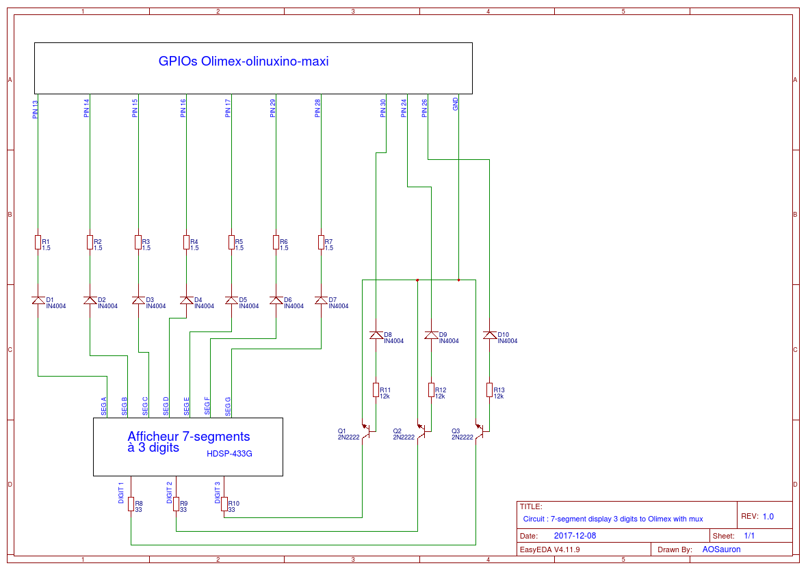

# Driver d'un triple afficheur 7 segments #

## Objetifs

Ce répertoire contient un projet de driver Linux embarqué pour la carte Olimex-olinuxino-maxi dont l'objectif est de commander
un triple afficheur 7 segments. Ce driver est lié à un second driver qui lui,
commande un sonar utilisé en tant que radar de proximité.

De la même façon que le driver précédemment cité, celui-ci met à disposition
un fichier virtuel disponible par l'intermédiaire du chemin suivant `/dev/display`
et accessible en écriture seule.

## Utilisation

Il est possible de demander l'affichage d'un nombre compris entre 0 et 999 par
l'intermédiaire du fichier virtuel cité ci-dessus. Pour ce faire il suffit d'écrire
un nombre entier codé sur 8 octets et compris entre 0 et 999. Il est possible de
réaliser très simplement l'action précédemment citée en ligne de commande grâce à
la commande suivante:

```sh
dd if=/dev/sonar of=/dev/display bs=8 count=1
```

L'exemple ci-dessus suppose la présence du driver contrôlant le sonar. Cette
commande lit les 8 premiers octets du fichier virtuel `/dev/sonar` et les écrient
dans le fichier virtuel dédié la commande de l'affichage `/dev/display`.

## GPIOs utlisées

Les GPIOs utilisées sur l'Olimex sont les suivantes (N° de PIN physiques) :

    - GND
    - PIN 13
    - PIN 14
    - PIN 15
    - PIN 16
    - PIN 17
    - PIN 24
    - PIN 26
    - PIN 28
    - PIN 28
    - PIN 30

## Spécification du circuit électrique utilisé

Matériel principal : Afficheur 7-segments **HDSP-433G** à cathode commune.

Les diodes **IN4004** sont là pour protéger le circuit et notamment la carte olimex.

Le PIN GND est la masse commune, une GPIO de la carte.

*Modèle de spécification :*
```
[HDSP-433G] Broche utilisée --> éventuels composants --> GPIO correspondante
```

#### Gestion des segments 

*Circuit :*
```
 - Segment A --> Diode IN4004 --> Résistance 1.5 Ohm --> PIN 13
 - Segment B --> Diode IN4004 --> Résistance 1.5 Ohm --> PIN 14
 - Segment C --> Diode IN4004 --> Résistance 1.5 Ohm --> PIN 15
 - Segment D --> Diode IN4004 --> Résistance 1.5 Ohm --> PIN 16
 - Segment E --> Diode IN4004 --> Résistance 1.5 Ohm --> PIN 17
 - Segment F --> Diode IN4004 --> Résistance 1.5 Ohm --> PIN 29
 - Segment G --> Diode IN4004 --> Résistance 1.5 Ohm --> PIN 28
```

####  Gestion des digits (multiplexeur)

Utilisation d'un multiplexeur pour pouvoir afficher plusieurs chiffres différents sur chaque digit "en même temps". En réalité le multiplexeur permet d'afficher un chiffre sur un segment à la fois mais en alternant sur les trois digit à une fréquence suffisamment élevée (assez rapide pour que l'oeil humain ne s'en aperçoive, c'est à dire un taux de rafraichissement de 20 images par secondes). Cette fréquence vaut *67 Hz*.

*Légendes :*
- (C) = Collecteur du transistor
- (B) = Base du transistor
- (E) = Emetteur du transistor

*Circuit :*
```
- Cathode commune digit 1 (gauche) --> Résistance 33 Ohm --> (C) Transistor 2N2222 (E) --> GND
                        (B) --> Résistance 12k Ohm --> Diode IN4004 --> PIN 26

- Cathode commune digit 2 (milieu) --> Résistance 33 Ohm --> (C) Transistor 2N2222 (E) --> GND
                        (B) --> Résistance 12k Ohm --> Diode IN4004 --> PIN 24

- Cathode commune digit 3 (droite) --> Résistance 33 Ohm --> (C) Transistor 2N2222 (E) --> GND
                        (B) --> Résistance 12k Ohm --> Diode IN4004 --> PIN 30
```

## Schéma électrique du circuit utilisé


