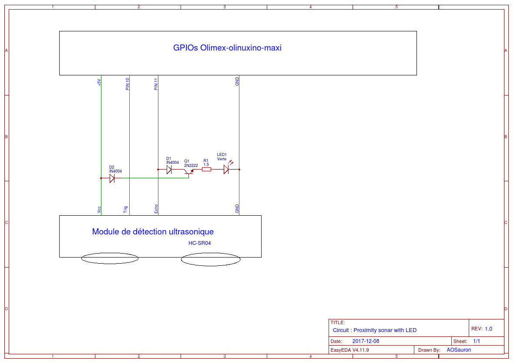

# Driver d'un radar de proximité #

## Objectifs

Ce répertoire contient un projet de driver Linux embarqué pour la carte Olimex-olinuxino-maxi dont l'objectif est de
commander un sonar qui permettre de calculer la distance aux objets à proximité.

Le driver met à disposition un fichier virtuel pour permettre de commander
facilement le sonar. Le fichier dont il est question est `/dev/sonar` qui est
accessible en lecture seule.

## Utilisation

Il est possible de lire la distance mesurée par le sonar en exécutant la
commande suivante dans un terminal:
```sh
dd if=/dev/sonar of=output.bin bs=8 count=1
```

On peut remarquer que la commande ci-dessus se limite à la lecture de 8 octets.
En effet, ce driver limite la taille de sa sortie à 8 octets, d'où la structure
de la commande précédente.

**N.B. :** Les mesures sont renvoyées en millimètres **(mm)** pour des raisons purement pratiques.
Une conversion d'unités est donc nécessaire, conversion qui introduit bien
évidemment un légère erreur de mesure qui vient s'ajouter à l'erreur intrinsèque
du matériel.

## GPIOs utilisées

Les GPIOs utilisées sur l'Olimex sont les suivantes (N° de PIN physiques) :

    - GND
    - +5V
    - PIN 10
    - PIN 11

## Spécification du circuit électrique utilisé

Matériel principal : Module de détection aux ultrasons **HC-SR04**

Les diodes **IN4004** sont là pour protéger le circuit et notamment la carte olimex et le module de détection.

Le PIN GND est la masse commune, une GPIO de la carte.

Une LED verte a été ajouté au circuit telle qu'elle s'allume à chaque "echo" du sonar.

*Modèle de spécification :*
```
[HC-SR04] Broche utilisée --> éventuels composants --> GPIO correspondante
```

*Légendes :*
- (C) = Collecteur du transistor
- (B) = Base du transistor
- (E) = Emetteur du transistor

*Circuit :*
```
- Vcc --> +5V
- GND (HC-SR04) --> GND (GPIO)
- Trig --> PIN 10
- Echo --> PIN 11
       |--> Diode IN4004 --> (C) Transistor 2N2222 (B) --> Diode IN4004 --> +5V
                             (E) Résistance 1.5 Ohm --> LED Verte --> GND   
```

## Schéma électrique du circuit utilisé


